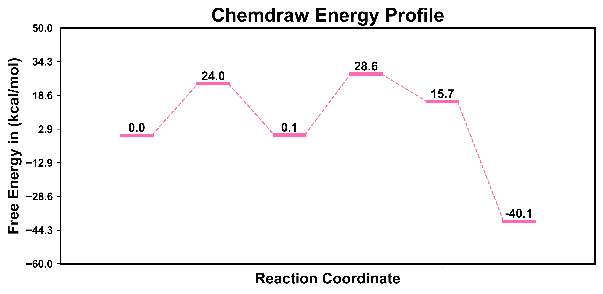

<h1 align="center">
    
</h1><br>


KimariPlot 是一款基于 Python 开发的开源绘图软件，主要用于快速绘制文献中常见的能量折线图和构象曲线图。相比于其他常用的绘图软件，KimariPlot 绘制这些视图更加方便，不需要使用鼠标一直拖来拖去，这是 KimariPlot 最大的优势。

除此之外，KimariPlot 还支持多种自定义图表类型和配置选项，用户可以通过文本编辑器创建和编辑 KimariPlot Input File 来配置图表。与其他绘图软件相比，KimariPlot 的使用体验更加轻松愉悦，使得用户更加专注于数据分析和可视化的过程。

## 安装

本项目已经开源在 Github 上，您可以通过以下步骤安装 KimariPlot：

1. 首先，您需要确保已经安装了 Python 环境和 pip 包管理工具。如果您还没有安装它们，请先安装它们。

2. 下载 KimariPlot 源代码：

```bash
git clone https://github.com/kimariyb/kimariPlot.git
```

3. 进入 KimariPlot 目录并安装依赖：

```bash
cd kimariPlot
pip install -r requirements.txt
```

这将自动安装 KimariPlot 所需的 numpy、matplotlib 和 scipy 等依赖项。请注意，如果您已经安装了这些依赖项，则可以跳过此步骤。


## 使用

要使用 KimariPlot，请执行以下步骤：

<h3><strong font-size:16pt;">请注意：在正式运行前，请确保已经安装了 Python 和 pip 包管理工具，以免程序报错！</strong></h3>

1. 在命令行中导航到 KimariPlot 目录。

2. 运行 main.py：

```bash
python main.py
```

3. 输入 KimariPlot Input File (.kpi) 文件的路径。例如：

```bash
example/line_test.kpi
```

4. 输入保存文件的名称。如果直接键入 `Enter` 即回车，则会使用默认的 `figure.png`。

5. 图片将会自动保存到指定的文件夹中。




## 关于 KimariPlot Input File

KimariPlot Input File (.kpi) 是一种用于配置 KimariPlot 图表的文件格式。它包含了绘制图表所需的所有参数和数据。

KimariPlot Input File 的结构如下所示：

```basic
%title = [标题 {str}]
%x = [x 轴标题 {str}]
%y = [y 轴标题 {str}]
%unit = [单位 {str}]
%size = [画布大小 {int}, {int}]
%style = [样式，可选择 line 和 curve]
%color = [颜色，可选择十六进制 {str}, {str}, {str}]
%font = [全局字体 {str}]

begin
[绘图数据，包括 x 坐标和 y 坐标，{float} {float}]
end
```

上文展示了绘制化学反应能量折线图的效果，如果想绘制构象能量曲线图，只需要更改 `.kpi` 文件中的 `style` 属性。

```basic
%style = curve
```

使用 KimariPlot 读取本项目下 `example/curve_test.kpi`，即可得到一个构象能量曲线图。


## 鸣谢

KimariPlot 的开发离不开以下开源项目：

- **NumPy**
- **Matplotlib**
- **SciPy**

还要感谢所有为 KimariPlot 做出贡献的开发者 Kimariyb 和用户。

## 许可证

KimariPlot 基于 **MIT** 许可证开源。这意味着您可以自由地使用、修改和分发代码。有关更多信息，请参见 LICENSE 文件。