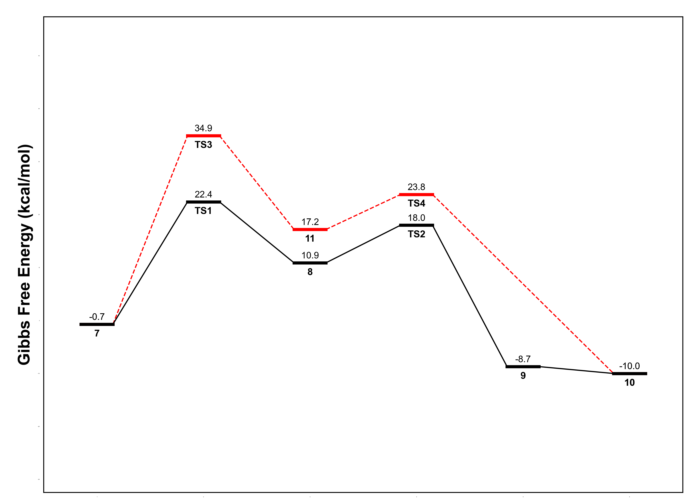
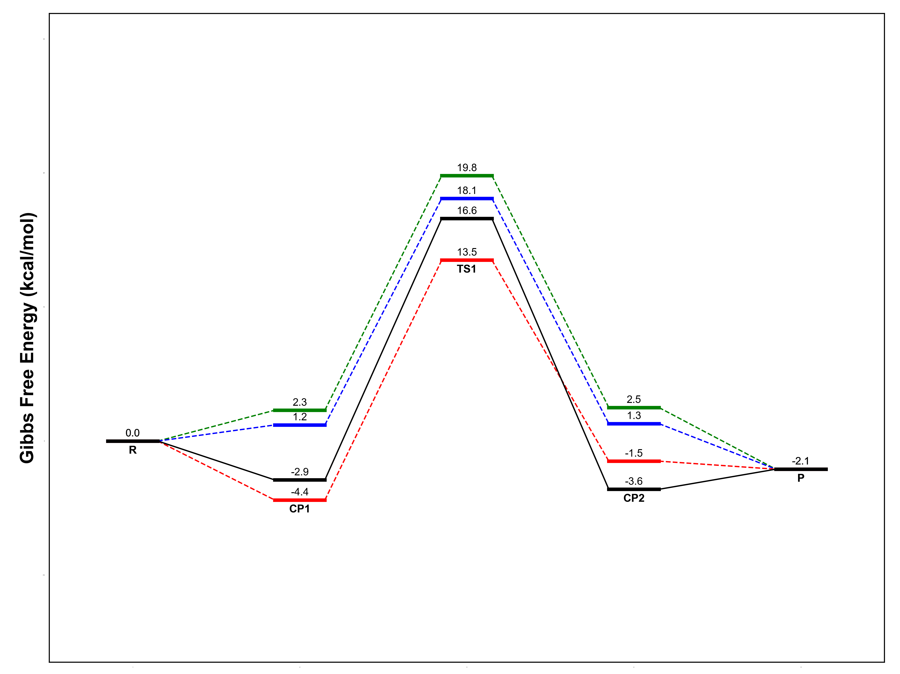

<h1 align="center">
    
</h1><br>


KimariPlot 是一个开源的 Python 绘图脚本，用来绘制科研中的 Free Energy Profile。KimariPlot 使用简单，可以直接从命令行读取 Toml 文件绘制 Free Energy Profile，可以不需要用鼠标一直拖来拖去，是懒人绘制 Free Energy Profile 的极佳选择。

## 安装

KimariPlot 可以使用 pip 工具直接安装。

```shell
pip install kimariplot
```

与此同时还需要安装 matplotlib 以及 toml 库（暂时不需要安装 numpy 和 pandas 库，以后可能需要）。

```shell
pip install matplotlib, toml
```

## 使用

安装完 KimariPlot 之后，可以直接通过如下命令在命令行中运行。接着就会在当前目录下生成 figure.png 图像文件。`profile.toml` 是一个 toml 文件，用来记录颜色、曲线格式以及绘制所需要的数据。

```shell
kimariplot profile.toml
```

简要介绍一下 toml 文件所需要配置的内容。`color` 为折线颜色，`style` 为折线的格式，可以为 `-` 或 `--`。`data` 为数据的列表，里面可以包括很多个 3 字符串元素的列表。第一个字符串表示名字；第二个字符串表示反应的进度，一般从 1 开始；第三个字符串表示反应的 Free Energy 能垒，一般都用 kcal/mol 表示。

```toml
[[path]]
color = "black"
style = "-"
data = [
    ["Name", "1", "0.0"],
    ["", "", ""],
]

[[path]]
...
```

使用 KimariPlot 命令时可以更改绘图的参数，KimariPlot 支持的参数如下所示。

```shell
usage: kimariplot [--help] [--output_type OUTPUT] [--dpi DPI] [--font FONT] [--size SIZE] [--version] input_file

Generate a energy profile using kimariplot

positional arguments:
  input_file            Please input a Toml file

options:
  --help, -h            Show this help message and exit
  --output_type OUTPUT, -o OUTPUT
                        The output type of the graph
  --dpi DPI, -d DPI     The dpi of the output graph
  --font FONT, -f FONT  The font family of the graph
  --size SIZE, -s SIZE  The size of the graph
  --version, -v         show program's version number and exit
```

## 绘制效果

本例在 `kimariplot` 的 `examples/profile1.toml` 中

```toml
[[path]]
color = "black"
style = "-"
data = [
    ["7", "1", "-0.7"],
    ["TS1", "2", "22.4"],
    ["8", "3", "10.9"],
    ["TS2", "4", "18.0"],
    ["9", "5", "-8.7"],
    ["10", "6", "-10.0"]
]

[[path]]
color = "red"
style = "--"
data = [
    ["7", "1", "-0.7"],
    ["TS3", "2", "34.9"],
    ["11", "3", "17.2"],
    ["TS4", "4", "23.8"],
    ["10", "6", "-10.0"]
]
```



本例在 `kimariplot` 的 `examples/profile2.toml` 中

```toml
[[path]]
color = "black"
style = "-"
data = [
    ["R", "1", "0.0"],
    ["", "2", "-2.9"],
    ["", "3", "16.6"],
    ["CP2", "4", "-3.6"],
    ["P", "5", "-2.1"]
]

[[path]]
color = "red"
style = "--"
data = [
    ["R", "1", "0.0"],
    ["CP1", "2", "-4.4"],
    ["TS1", "3", "13.5"],
    ["", "4", "-1.5"],
    ["P", "5", "-2.1"]
]

[[path]]
color = "blue"
style = "--"
data = [
    ["", "1", "0.0"],
    ["", "2", "1.2"],
    ["", "3", "18.1"],
    ["", "4", "1.3"],
    ["", "5", "-2.1"]
]

[[path]]
color = "green"
style = "--"
data = [
    ["", "1", "0.0"],
    ["", "2", "2.3"],
    ["", "3", "19.8"],
    ["", "4", "2.5"],
    ["", "5", "-2.1"]
]
```



## 鸣谢

KimariPlot 的开发离不开以下开源项目：

- **NumPy**
- **Matplotlib**
- **SciPy**
- **Toml**

还要感谢所有为 KimariPlot 做出贡献的开发者 Kimariyb 和用户。

## 许可证

KimariPlot 基于 **MIT** 许可证开源。这意味着您可以自由地使用、修改和分发代码。有关更多信息，请参见 LICENSE 文件。